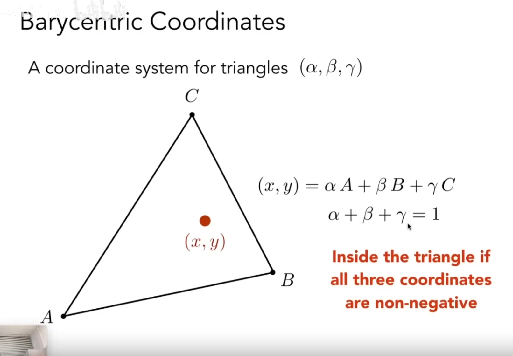

# 软光栅化

## 坐标系和反向
1. 使用右手左边系
2. 逆时针反向为正反向

## 叉乘(Cross)
### 二维向量A和向量B叉乘的物理意义：
1. 叉乘的值 >0(B在A的左边), =0(A和B方向一致), <0(B在A的右边)
2. 叉乘的值等于OAB组成的三角形的面积的2倍

### 叉乘的实现如下：
```c++
float Cross2D(Vector2 A, Vector2 B)
{
    retrun A.x * B.y - A.y * B.x;
}
float Cross3D(Vector3 A, Vector3 B)
{

}
```

## 判断点是否在三角形内
假设求点P是否在三角形A、B、C内

## 三角形内部插值


